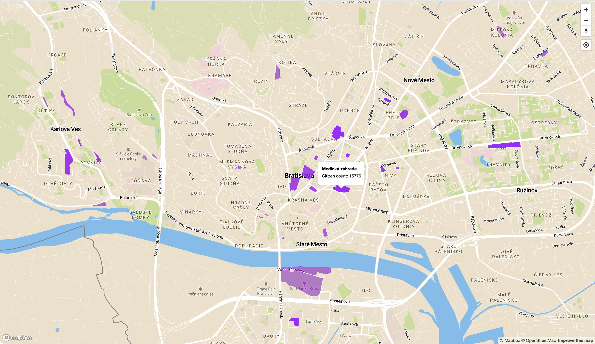
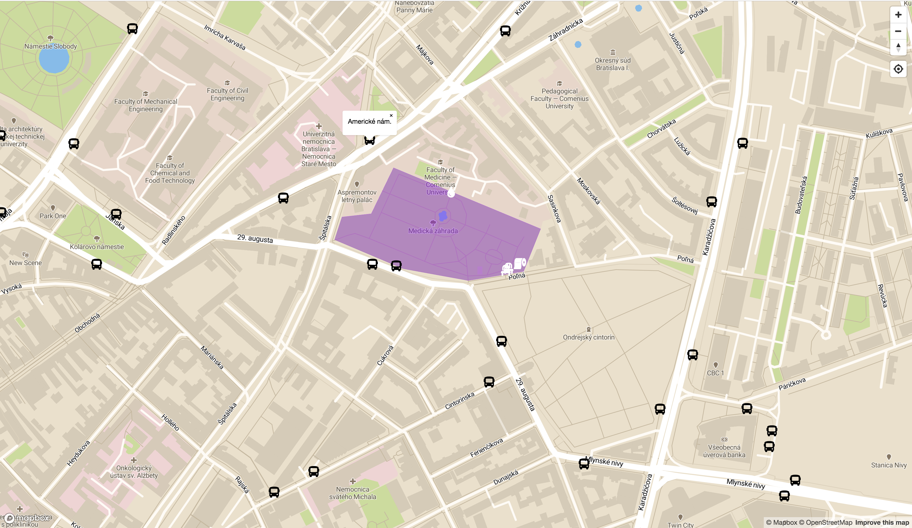
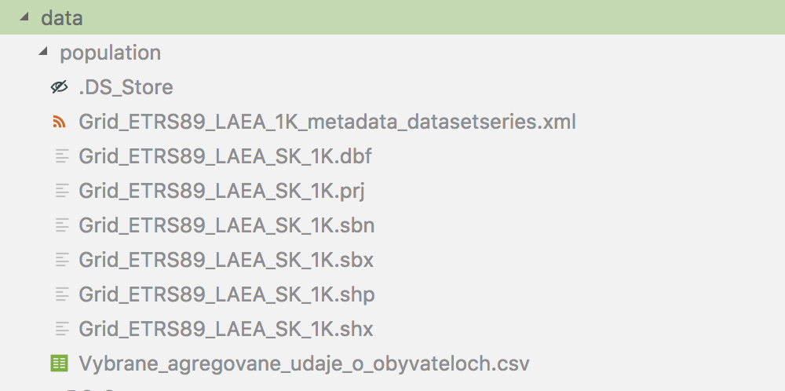

# Overview

My application provides an overview of 40 parks located all over Bratislava. The most important features are:

- overview of 40 parks all over Bratislava
- an approximate number of citizens living in a close proximity of each park
- display of benches, toilets and drinking water fountains inside each park (if it has any) 
- display of the nearest bus stops for each park

# Screenshots



This screenshot displays an initial map view, which shows an overview of 40 parks all over Bratislava. Parks are highlighted via a purple color. The lower the opacity, the greater number of citizens live near it. If user hovers his mouse over a park, the application shows a popup with park's name and an approximate number of citizens that live in the proximity of 1-2 km from a given park.



After a user clicks on one of the highlighted parks, the map will zoom in and display park details. The opacity will be lowered, so the park name can be seen from the map layer. The application will display white markers that represent benches, toilets and drinking water places inside the park, as well as black markers that represent bus stops 1 km less from the selected park. If user hovers his mouse over a marker, the application will display a popup with a park amenity description or a bus stop name.

# Architecture

The application has 2 separate parts - a client which is a [frontend web application](#frontend) that is using Mapbox and Mapbox GL JS written and a [backend application](#backend) written in Node.js, backed by a PostGIS. Frontend application communicates with a backend using a [REST API](#api).

# Frontend

The frontend application is based on Pug files (`index.pug` and `layout.pug`), which are converted into a single HTML file by Express middleware during run-time. This HTML file is sent to the client browser together with a JavaScript script (`main.js`) and CSS stylesheet (`style.css`, converted from `style.scss`). Map uses a basic Mapbox stylesheet. Markers are based on icons from Font Awesome.

Frontend code is responsible for:
- displaying the map and capturing user interaction with a map
- displaying geo features by overlaying the map with a GeoJSON layer, which is provided directly by backend APIs

# Backend

The backend application is based on Node.js and Express. It is responsible for querying geo data and formatting the geojson.

## Data

Park data comes from OpenStreetMap. It was provided together with a Docker image for a PostGIS.

I have also gathered another dataset for determining how many citizens live near parks in Bratislava. In this dataset, Slovakia is divided into 1 km^2 squares. This dataset is a result of comining two separate datasets:

1. The first dataset contains geometry of each square all over Slovakia. I have downloaded it from [Štatistický úrad SR - Population and Housing Census](https://slovak.statistics.sk/wps/portal/ext/themes/demography/census/indicators/!ut/p/z1/jZHfTsMgFIefZQ-wcoCu0EtaLcVhLf23yY2pZlmarJsXRuPbS0hjYszanSvI-T7g_EAW7ZE995_Dsf8YLuf-5PbPNnrpdMmTBAvg-SMGlemyK-8bXCWAdh4wTE1A0hFQrKjw1hi5bRmy19sqJpOfSpGHTANwLTegRN5WsaEUBPX-4v1wpQTc5s888Cb_F5CscUBR1G3HDTXL_gOyw-sYfL2NAQQcA4sjTGnoVhvsDrdz-fl4PZDVJRFxKNO76ikD1aSE1zoiIKMFAPAEzP2AB-Yi_jvk_wyK_DIe0PvYutp_12pQa7Fa_QCIE5IB/dz/d5/L2dBISEvZ0FBIS9nQSEh/) (Raster – dataset Grid_ETRS89_LAEA_SK_1K) and used `shp2pgsql` utility to import data from `.shp` file into a PostGIS database.
2. The second dataset contains statistical information about how many people live in each square. I have downloaded it from the same page (Aggregated data on population), converted `.xlsx` into a `.csv` and imported data via `psql` using `\create` command into a PostGIS database.

After download I have placed the files into the `service-pdt-server/data` folder like this:



## Queries

### Display all parks and number of citizens that live near them

This query fetches the data for displaying all parks and number of citizens that live near them. It uses data from **OpenStreetMap** and from **Štatistický úrad SR - Population and Housing Census** datasets. The first version joined 3 tables and only the `planet_osm_polygon.way` column was indexed (it was by default). Here is a query:

```sql
with pop as (
  select
    pop."name"
    ,ST_Transform(pop.way, 4326) as way
    ,ST_Transform(ST_Centroid(pop.way), 4326) as center_point
    ,sum(pdat.tot_p) as population
  from planet_osm_polygon pop
  join population_geometry pgeo
    on st_dwithin(
      st_transform(pop.way, 3857),
      st_transform(pgeo.geom, 3857),
      0
    )
  join population_data pdat
    on pgeo.grd_newid = pdat.grd_newid
  where 1=1
    and pop.leisure = 'park'
    and pop."name" is not null
  group by pop."name", pop.way
)
select jsonb_build_object(
  'type', 'FeatureCollection',
  'features', jsonb_agg(features.feature)
) as "json"
from (
  select jsonb_build_object(
    'type', 'Feature',
    'geometry', ST_AsGeoJSON(ST_Transform(pop.way, 4326), 15, 1)::jsonb,
    'properties', jsonb_build_object(
      'name', pop."name",
      'population', pop.population,
      'center_point', ST_AsGeoJSON(pop.center_point)::jsonb
    )
  ) as feature
  from pop
) features;
```

The result of `EXPLAIN ANALYZE` was that the query took 5348 miliseconds and used Sequential Scans for data required to join all tables. No user can wait for so long each time the whole map is loaded, so this query needed some optimalization.

For the second version I have combined `population_geometry` and `population_data` tables into a single table `population_data_geometry`, as well as created indices for it (`gist (ST_Transform(geom, 3857))`) and for `planet_osm_polygon` (`gist (ST_Transform(way, 3857))`). Here is the query:

```sql
with pop as (
  select
    pop."name"
    ,pop.osm_id
    ,ST_Transform(pop.way, 4326) as way
    ,ST_Transform(ST_Centroid(pop.way), 4326) as center_point
    ,sum(pdat.tot_p) as population
  from planet_osm_polygon pop
  join population_data_geometry pdat
    on st_dwithin(
      st_transform(pop.way, 3857),
      st_transform(pdat.geom, 3857),
      0
    )
  where 1=1
    and pop.leisure = 'park'
    and pop."name" is not null
  group by pop.osm_id, pop."name", pop.way
)
select jsonb_build_object(
  'type', 'FeatureCollection',
  'features', jsonb_agg(features.feature)
) as "json"
from (
  select jsonb_build_object(
    'type', 'Feature',
    'geometry', ST_AsGeoJSON(ST_Transform(pop.way, 4326), 15, 1)::jsonb,
    'properties', jsonb_build_object(
      'id', pop.osm_id,
      'name', pop."name",
      'population', pop.population,
      'center_point', ST_AsGeoJSON(pop.center_point)::jsonb
    )
  ) as feature
  from pop
) features;
```

The result of `EXPLAIN ANALYZE` was that the query took 22 miliseconds and used Indexed Scan for data required to join two tables. I consider this query execution time acceptable and did not do any other optimalizations for this query.

### Displaying a selected park via ID

This query fetches the data for a park with a provided ID. It uses data from **OpenStreetMap**. Here is a query:

```sql
select jsonb_build_object(
  'type', 'FeatureCollection',
  'features', jsonb_agg(features.feature)
) as "json"
from (
  select jsonb_build_object(
    'type', 'Feature',
    'id', osm_id,
    'geometry', ST_AsGeoJSON(
      ST_Transform(pop.way, 4326), 15, 1
    )::jsonb,
  'properties', jsonb_build_object(
      'name', "name",
      'center_point', ST_AsGeoJSON(
        ST_Transform(ST_Centroid(pop.way), 4326)
      )::jsonb
  )
  ) as feature
  from planet_osm_polygon as pop
  where 1=1
    and leisure = 'park'
    and osm_id = $1
) features;
```

$1 parameter is replaced with a park id. The result of `EXPLAIN ANALYZE` was that the query took 252 miliseconds and used Sequential Scans for finding parks with a required values of `leisure` and `osm_id` columns of `planet_osm_polygon` table. I have created an index for this 2 columns and after that the query took only 3 miliseconds and used only Index Scans.

### Displaying amenities inside a selected park via park ID

This query fetches the data for amenities inside a selected park via park ID. Amenities are of 3 types: 'bench', 'drinking_water' and 'toilets'. It uses data from **OpenStreetMap**. Here is a query:

```sql
with popo as (
select
  popo.osm_id
  ,popo.way
  ,popo.amenity as marker
from planet_osm_point popo, planet_osm_polygon pop
where 1=1
  and pop.leisure = 'park'
  and pop.osm_id = $1
  and st_contains(
    pop.way,
    popo.way
  )
  and popo.amenity in (
    'bench',
    'drinking_water',
    'toilets'
  )
)
select jsonb_build_object(
'type', 'FeatureCollection',
'features', jsonb_agg(features.feature)
) as "json"
from (
select jsonb_build_object(
  'type', 'Feature',
  'geometry', ST_AsGeoJSON(ST_Transform(popo.way, 4326), 15, 1)::jsonb,
  'properties', jsonb_build_object(
      'id', popo.osm_id,
      'marker', popo.marker
  )
) as feature
from popo
) features;
```

$1 parameter is replaced with a park id. The result of `EXPLAIN ANALYZE` was that the query took 3 miliseconds and used Bitmap Heap Scan for `amenity` column of `planet_osm_point` table (indices for `leisure` and `osm_id` columns of `planet_osm_polygon` table were already created). I consider this query execution time acceptable and it did not improve even after I have created an index for an `amenity` column of `planet_osm_point` table.

### Displaying amenities inside a selected park via park ID

This query fetches the data for bus stops max. 1 km from a selected park via park ID. It uses data from **OpenStreetMap**. Here is a query:

```sql
with popo as (
select
  popo.osm_id
  ,popo."name"
  ,popo.way
  ,popo.highway as marker
from planet_osm_point popo, planet_osm_polygon pop
where 1=1
  and pop.leisure = 'park'
  and pop.osm_id = $1
  and popo.highway = 'bus_stop'
  and st_dwithin(
    st_transform(pop.way, 3857),
    st_transform(popo.way, 3857),
    1000
  )
)
select jsonb_build_object(
  'type', 'FeatureCollection',
'features', jsonb_agg(features.feature)
) as "json"
from (
  select jsonb_build_object(
    'type', 'Feature',
  'id', popo.osm_id,
  'geometry', ST_AsGeoJSON(ST_Transform(popo.way, 4326), 15, 1)::jsonb,
  'properties', jsonb_build_object(
      'marker', popo.marker,
      'name', popo."name"
    )
  ) as feature
  from popo
) features;
```

$1 parameter is replaced with a park id. The result of `EXPLAIN ANALYZE` was that the query took 10 miliseconds, used Sequential Scan for `highway` column of `planet_osm_point` table (indices for `leisure` and `osm_id` columns of `planet_osm_polygon` table were already created, as well as an index for a transformed `way`). I have created index for a `highway` column of `planet_osm_point` table as well as one more index for `planet_osm_point` (`gist (ST_Transform(geom, 3857))`) after which query took only 4 miliseconds.

## API

**Fetch all parks**

Request:
`GET /data/parks`

Example response:
```json
{
  "type":"FeatureCollection",
  "features":[
    {
      "id":4418689,
      "type":"Feature",
      "geometry":{
        "bbox":[
          17.115098860253891,
          48.141923802834434,
          17.116174233480510,
          48.143316870387373
        ],
        "type":"Polygon",
        "coordinates":[
          [
            [
              17.1150988602539,
              48.1430862136211
            ],
            ...
          ]
        ]
      },
      "properties":{
        "name":"Landererov park",
        "population":5622,
        "center_point":{
          "type":"Point",
          "coordinates":[
            17.115586173643,
            48.1425737403876
          ]
        }
      }
    },
    ...
  ]
}
```

**Fetch park via ID**

Request:
`GET /data/park/:id`

Example request:
`GET /data/park/5044350`

Example response:
```json
{
  "type":"FeatureCollection",
  "features":[
    {
      "id":5044350,
      "type":"Feature",
      "geometry":{
        "bbox":[
          17.117439151232077,
          48.149083791787326,
          17.121640122658263,
          48.150618407530708
        ],
        "type":"Polygon",
        "coordinates":[
          [
            [
              17.1174391512321,
              48.1496392075175
            ],
            ...
          ]
        ]
      },
      "properties":{
        "name":"Medická záhrada",
        "center_point":{
          "type":"Point",
          "coordinates":[
            17.1195676117418,
            48.1497392178988
          ]
        }
      }
    }
  ]
}
```

**Fetch park amenities via park ID**

Request:
`GET /data/park/:id/markers`

Example request:
`GET /data/park/5044350/markers`

Example response:
```json
{
  "type":"FeatureCollection",
  "features":[
    {
      "type":"Feature",
      "geometry":{
        "bbox":[
          17.119809895098399,
          48.150270613264581,
          17.119809895098399,
          48.150270613264581
        ],
        "type":"Point",
        "coordinates":[
          17.1198098950984,
          48.1502706132646
        ]
      },
      "properties":{
        "id":5917052188,
        "marker":"drinking_water"
      }
    },
    ...
  ]
}
```

**Fetch bus stops near park via park ID**

Request:
`GET /data/park/:id/buses`

Example request:
`GET /data/park/5044350/buses`

Example response:
```json
{
  "type":"FeatureCollection",
  "features":[
    {
      "id":1593569576,
      "type":"Feature",
      "geometry":{
        "bbox":[
          17.116203518558773,
          48.146191780941450,
          17.116203518558773,
          48.146191780941450
        ],
        "type":"Point",
        "coordinates":[
          17.1162035185588,
          48.1461917809415
        ]
      },
      "properties":{
        "name":"Nemocnica sv. Michala",
        "marker":"bus_stop"
      }
    },
    ...
  ]
}
```

# Usage

## Requirements

* Bash
* Docker
* docker-compose

## Git clone

```
git clone --recurse-submodules https://github.com/node-ex/assignment-gis
```

## Preparation

Create `.env` files inside `common-postgis` and `service-pdt-server` folders. Put personal public Mapbox token into an `.env` file inside `service-pdt-server` folder and network name identical to that for `service-pdt-server` into an `.env` file inside `common-postgis` folder.

## Start

```
cd ./service-pdt-server
./_script/docker-container-up-dev-dependencies.sh
```

This will create a Docker network, Docker volume, as well as build and start all required Docker containers.

Use the following command to know when a Node.js application is started:

```
docker container logs -f nodeex-service-pdt-server-dev
```

## Stop

```
cd ./service-pdt-server
./_script/docker-container-down-dev-dependencies.sh
```

This will delete a Docker network, Docker volume, as well as delete all associated Docker containers.